```mermaid
flowchart TD
    ROOT["🎯 CLOSE THE 30-YEAR LIFE EXPECTANCY GAP\nEnglewood vs. Streeterville"]

    ROOT --> HC["Healthcare"]
    ROOT --> FA["Food Access"]
    ROOT --> HO["Housing &\nCommunity Building"]
    ROOT --> ED["Education &\nYouth Development"]
    ROOT --> MT["Mobility &\nTransit"]
    ROOT --> RC["Recreation &\nCommunity"]
    ROOT --> CP["Other City\nProjects"]
    ROOT --> IM["IMAN\nInitiatives"]
    ROOT --> FU["Funding"]

    HC --> HC1["FQHC Expansion\n~1.5 yr LE gain"]
    HC --> HC2["CHW Programs\n~1.0 yr LE gain"]
    HC --> HC3["Medicaid Enrollment\n~0.7 yr LE gain"]
    HC --> HC4["Barbershop BP\nScreening · ~0.6 yr"]
    HC --> HC5["MOUD + Naloxone\n~0.8 yr LE gain"]
    HC --> HC6["Integrated Behavioral\nHealth · ~0.8 yr"]

    FA --> FA1["Fresh Boost /\nSNAP Enrollment · ~0.6 yr"]
    FA --> FA2["WIC Access\n~0.5 yr LE gain"]
    FA --> FA3["Fresh Market\nExpansion · ~0.8 yr"]
    FA --> FA4["SSB Tax /\nFood Pricing Policy"]
    FA --> FA5["EITC + Income\nTransfers · ~0.4 yr"]

    HO --> HO1["Permanent Supportive\nHousing · ~1.5 yr"]
    HO --> HO2["Housing Mobility\nVouchers · ~1.0 yr"]
    HO --> HO3["Community Land\nTrusts · ~0.5 yr"]
    HO --> HO4["Mixed-Income\nDevelopment · ~0.7 yr"]
    HO --> HO5["Lead Remediation\n~0.6 yr LE gain"]

    ED --> ED1["Early Childhood\nEducation · ~2.0 yr"]
    ED --> ED2["Nurse-Family\nPartnership · ~1.5 yr"]
    ED --> ED3["School Funding\nEquity · ~1.0 yr"]
    ED --> ED4["Teacher Quality\nInvestment · ~0.8 yr"]
    ED --> ED5["Neighborhood Poverty\nReduction · ~1.5 yr"]

    MT --> MT1["PM2.5 Reduction /\nBus Electrification · ~0.4 yr"]
    MT --> MT2["CTA Racine Green\nLine Reopening"]
    MT --> MT3["Safe Walking\nRoutes · ~0.3 yr"]
    MT --> MT4["Active Transit\nInfrastructure · ~0.2 yr"]

    RC --> RC1["Vacant Lot\nGreening · ~0.5 yr"]
    RC --> RC2["Griot Plaza /\nCommunity Corridors"]
    RC --> RC3["Park & Greenspace\nAccess · ~0.3 yr"]
    RC --> RC4["Community Health\nNodes · ~0.6 yr"]

    CP --> CP1["Group Violence\nIntervention · ~1.0 yr"]
    CP --> CP2["Cure Violence /\nREADI · ~1.5 yr"]
    CP --> CP3["Summer Youth\nEmployment · ~0.6 yr"]
    CP --> CP4["Naloxone\nSaturation · ~0.7 yr"]
    CP --> CP5["Vacant Lot\nRestoration · ~0.5 yr"]

    IM --> IM1["Health Center\nExpansion · ~1.5 yr"]
    IM --> IM2["Regenerator\nHousing · ~1.0 yr"]
    IM --> IM3["Green Reentry\nWorkforce · ~0.8 yr"]
    IM --> IM4["Fresh Market\nOperations · ~0.8 yr"]
    IM --> IM5["Weekend Warriors\nYouth · ~0.5 yr"]
    IM --> IM6["IMAN Oasis\nCafé + Community"]

    FU --> FU1["NMTC / HUD\nChoice Neighborhoods"]
    FU --> FU2["CDFI /\nSocial Impact Bonds"]
    FU --> FU3["SNAP / WIC /\nEITC Programs"]
    FU --> FU4["Philanthropy +\nFoundation Grants"]
    FU --> FU5["City & State\nCapital Grants"]

    style ROOT fill:#1A3A1A,color:#7FBA00,stroke:#7FBA00,stroke-width:3px
    style HC fill:#2D5A1B,color:#fff
    style FA fill:#2D5A1B,color:#fff
    style HO fill:#2D5A1B,color:#fff
    style ED fill:#2D5A1B,color:#fff
    style MT fill:#2D5A1B,color:#fff
    style RC fill:#2D5A1B,color:#fff
    style CP fill:#2D5A1B,color:#fff
    style IM fill:#7FBA00,color:#1A3A1A,stroke:#1A3A1A
    style FU fill:#2D5A1B,color:#fff
```

---

## How to embed this in PowerPoint (without exiting the presentation)

**Option 1 — Convert to PNG (Recommended):**
1. Go to **[mermaid.live](https://mermaid.live)** — paste the diagram code above (the text between the triple backticks)
2. Click **Export → PNG** (choose high resolution: 2x or 3x scale)
3. In PowerPoint: **Insert → Pictures → This Device** → select the downloaded PNG
4. Resize to fill the slide — the image is fully visible during the presentation without clicking anything

**Option 2 — VS Code extension:**
1. Install the **Mermaid Preview** extension in VS Code
2. Open this `.md` file — click the preview icon
3. Right-click the diagram → **Save Image** → insert into PowerPoint

**Option 3 — GitHub rendering:**
If the `.md` file is pushed to a GitHub repo, GitHub renders Mermaid natively in the file viewer. Screenshot the rendered diagram and insert as image.

**Tip for readability on-slide:** The diagram is wide. Set the PNG to landscape orientation and use a full-bleed slide (no header/footer) for maximum legibility. You may want to split it into two slides — one for the 9 domain boxes, one for sub-topics per domain.
